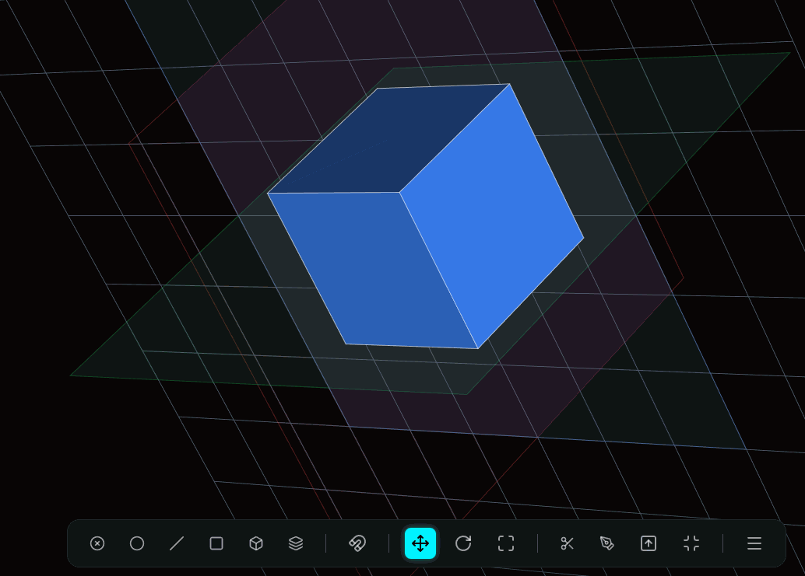
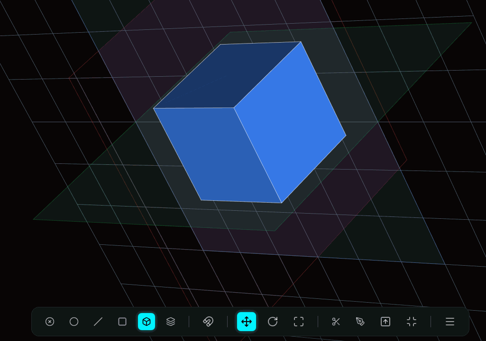
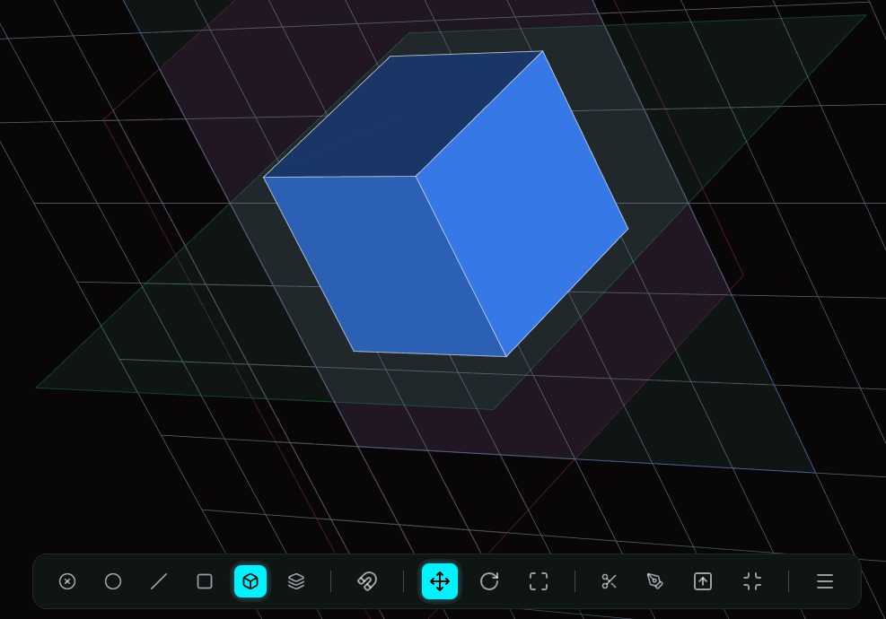
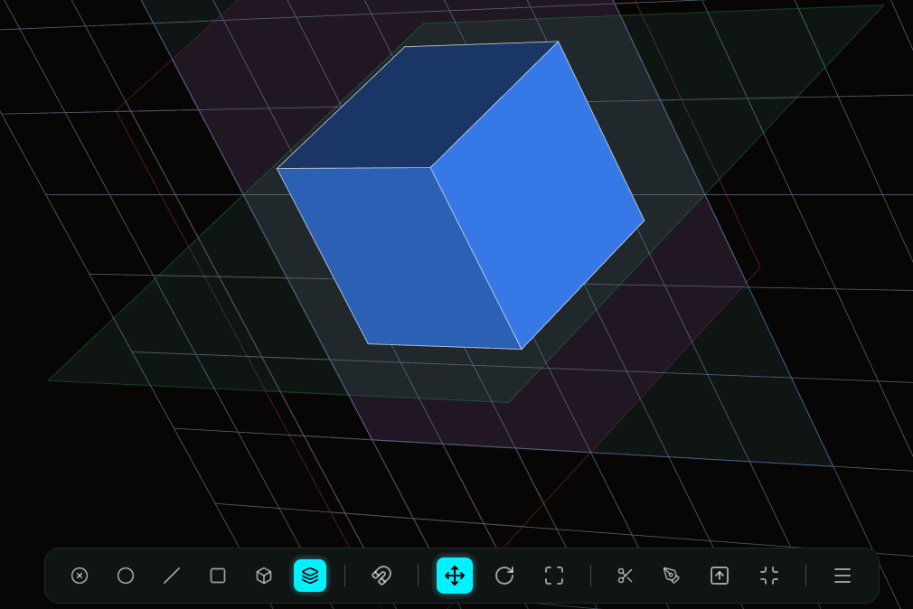
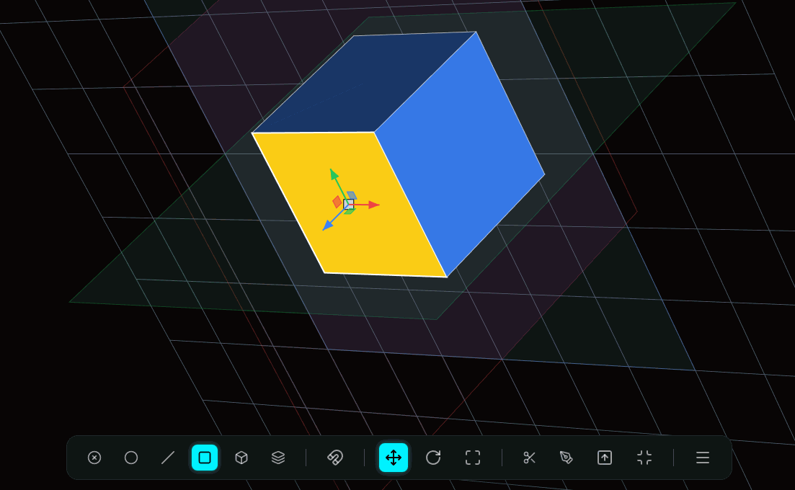
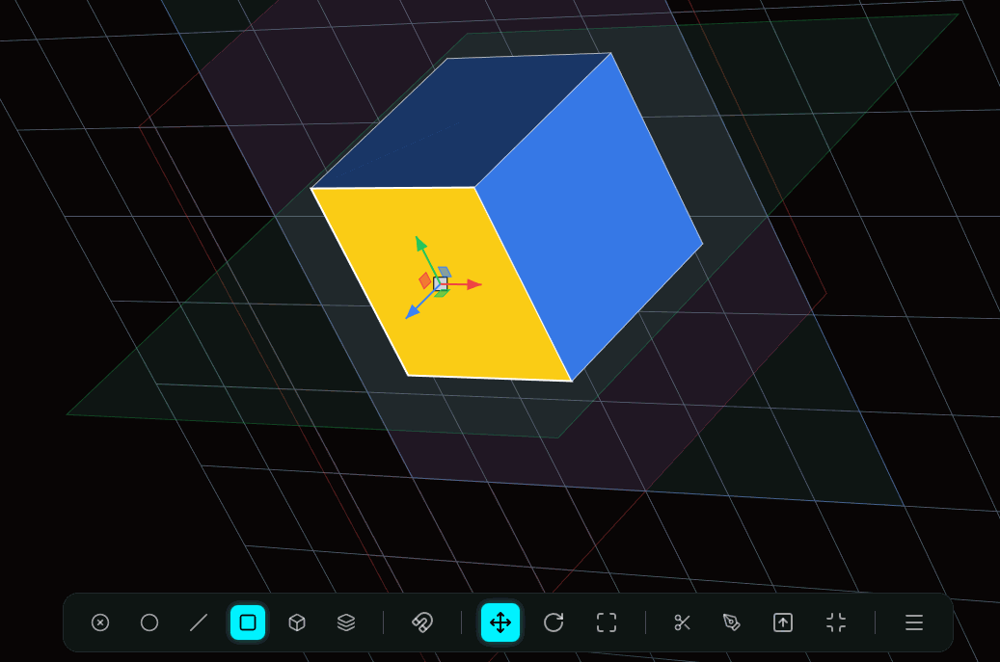
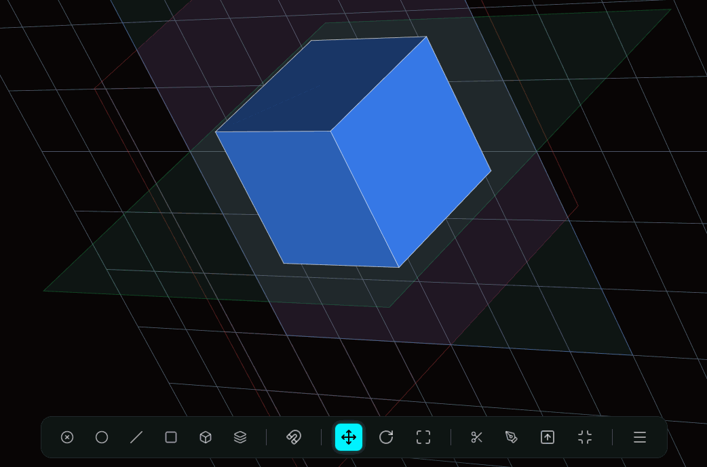
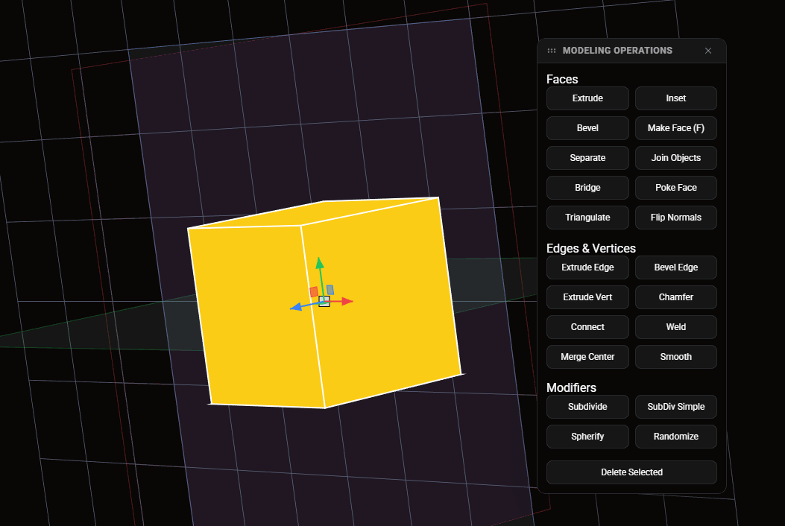
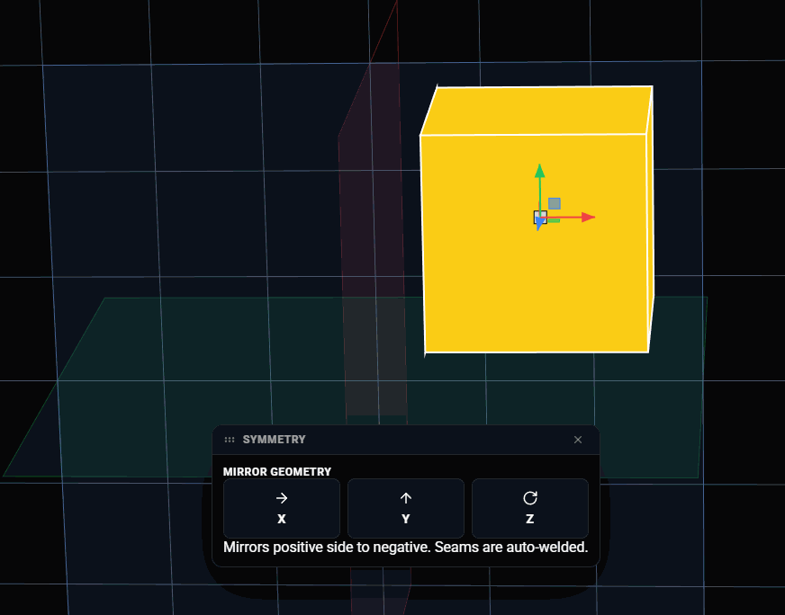
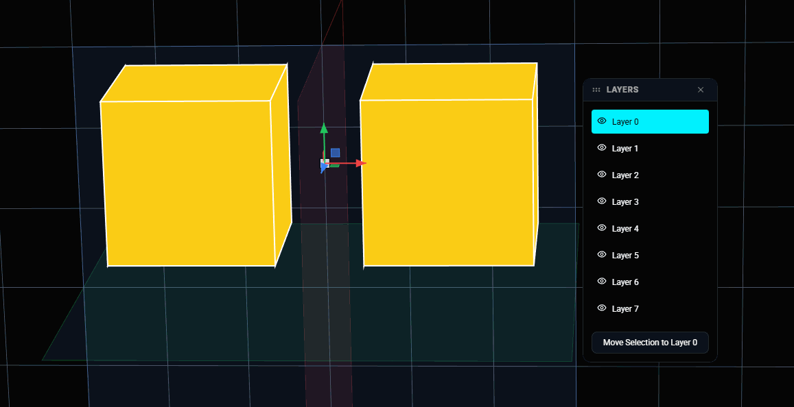

# Xocopoli v2 🧊

**Xocopoli v2** es una potente herramienta de modelado 3D basada en la web, construida con **React**, **TypeScript** y **Three.js**. Permite a los usuarios crear, editar y manipular geometría 3D directamente en el navegador con una interfaz intuitiva y herramientas de nivel profesional.

🔗 **[Demo Pública](https://xococode.github.io/XocoPoli/)**

---

## ✨ Características Principales

### 🎯 Modos de Selección
Xocopoli v2 ofrece un control granular sobre tu geometría.

| Modo | Descripción | Previsualización |
|------|-------------|------------------|
| **Vertex** | Selecciona y manipula vértices individuales para un control preciso. |  |
| **Edge** | Trabaja con las aristas de tu modelo. |  |
| **Face** | Selecciona polígonos o caras completas. |  |
| **Object** | Manipula objetos completos en la escena. |  |
| **Multi** | Selección versátil adaptada a tus necesidades. |  |

---

### 🛠️ Herramientas de Modelado
Un set completo de operaciones para dar vida a tus ideas.

#### Extrusión e Inset
*   **Extrude**: Crea nueva geometría a partir de caras o aristas existentes.
*   **Inset**: Crea nuevas caras dentro de las seleccionadas.

 

#### Cortes y Subdivisiones
*   **Loop Cut**: Añade bucles de aristas para refinar la topología.
*   **Knife**: Corta geometría libremente dibujando sobre las caras.
*   **Subdivide**: Aumenta la resolución de tu malla suavizando o dividiendo caras.

  

#### Creación de Geometría
*   **Make Face**: Crea caras rellenando espacios entre vértices seleccionados.

 

#### Simetría
*   **Symmetry**: Refleja tu modelo en los ejes X, Y o Z para un modelado rápido de objetos simétricos.

---

### 📦 Gestión de Escena

#### Capas (Layers)
Organiza tu escena utilizando un sistema de capas robusto. Oculta, bloquea o visualiza partes específicas de tu modelo.

